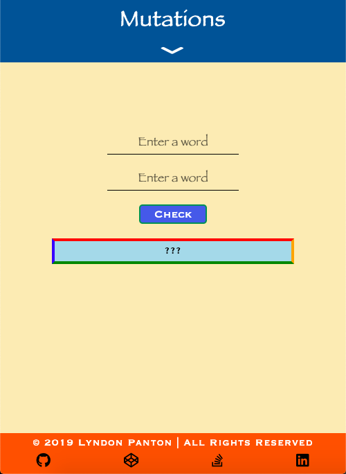
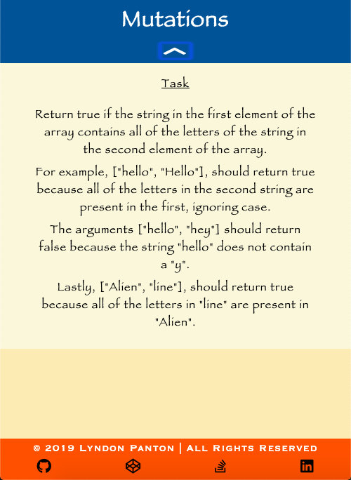
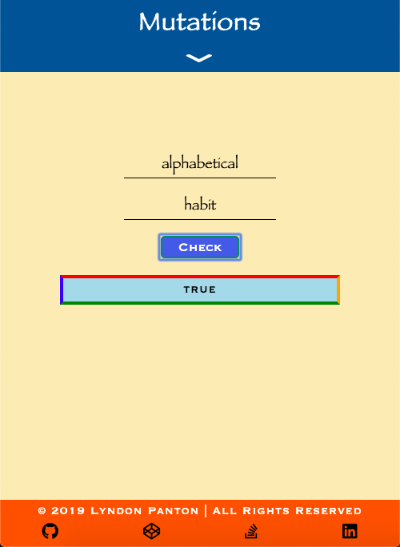
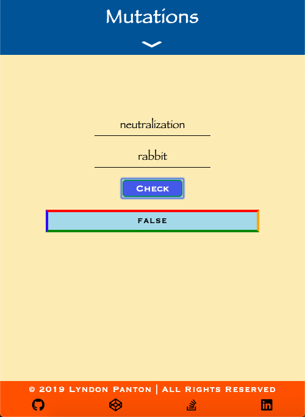
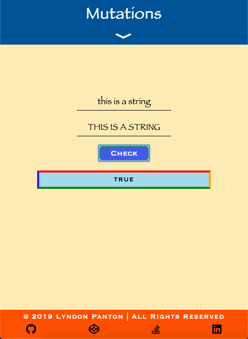

# Mutations

## How To Open
> 1. Go to the project's download folder
> 2. Right click on the file named _index.html_
> 3. Choose the _open with_ option
> 4. Open the project in your desired browser

## How To Use
> 1. Enter a string into the first input field
> 2. Enter a string into the second input field
> 3. Click the _check_ button
> 4. If the input is invalid an error message will be displayed
> 5. If the input is valid, true will be displayed if all of the characters in the second string are in the first string and false will be displayed if not all of the characters in the second string are in the first string

## Requirements
> 1. This project requires a browser to run
> 2. The browser must have JavaScript available and enabled

## Extra Information
> 1. This was done for one of freecodecamp's Basic Algorithm Scripting activities

## Preview

